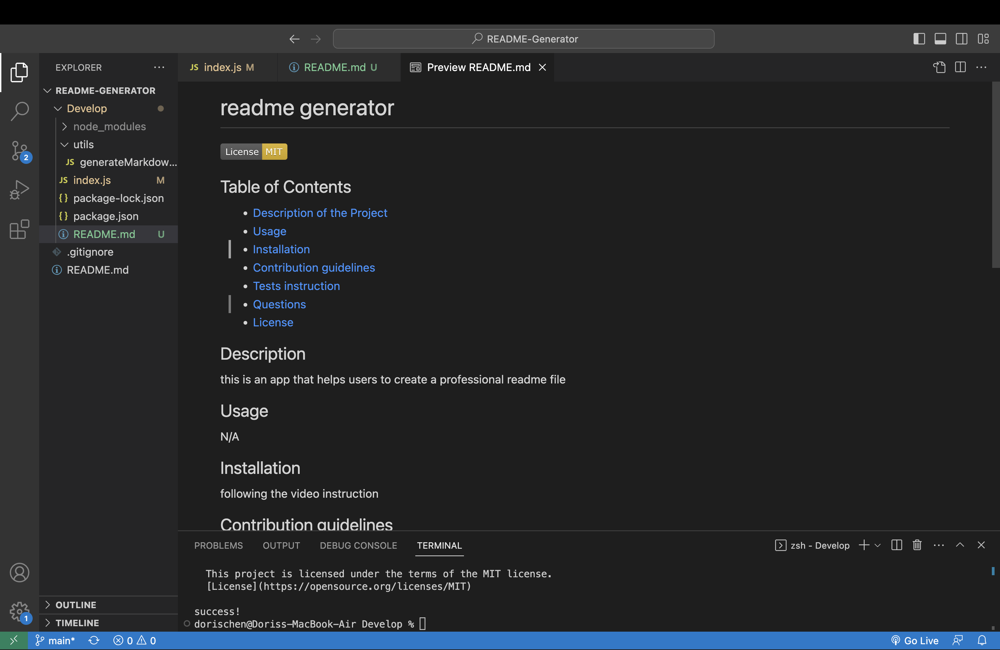

# README Generator

## Description

This is a command line application that helps users to create a professional readme file.

## Screenshot

## Link

GitHub Repository
https://github.com/Chenson92/README-Generator

Video Instruction
https://drive.google.com/file/d/1yBwzuThznfCUlIFINU2Dp7g1J9tYPMv4/view
